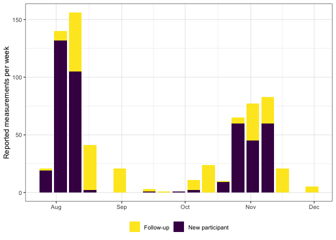
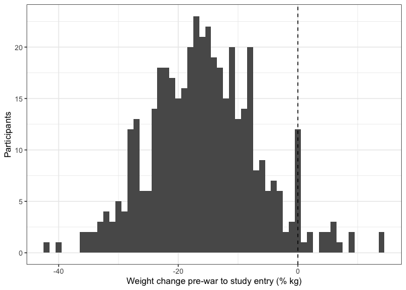
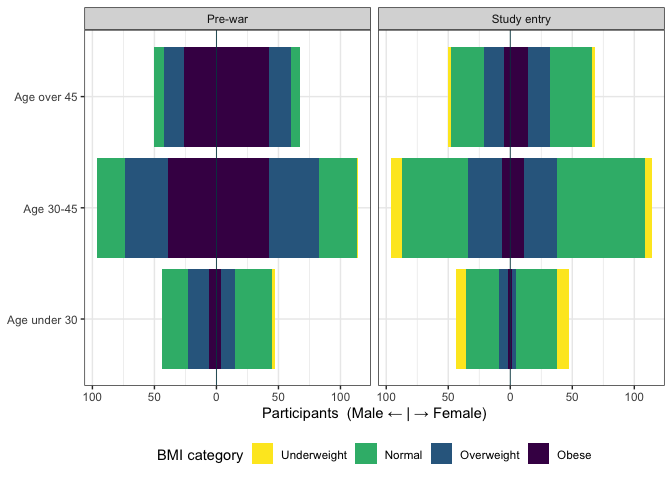
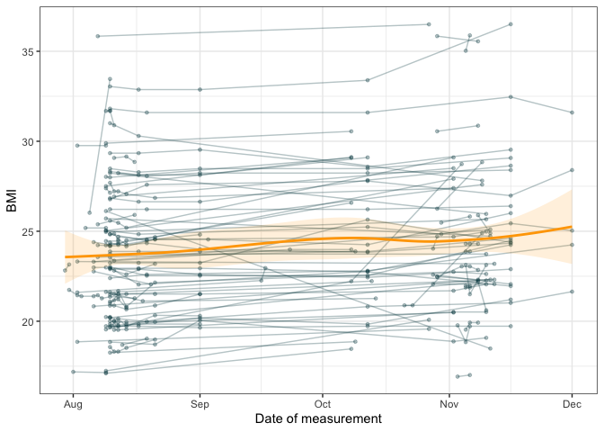

# Reporting

The below reports data quality and outcomes. See
[manuscript.qmd](./report/manuscript.qmd) for draft text (or render to
markdown:
`quarto::quarto_render(here::here("report", "manuscript.qmd"))`).

### Data processing

- Weight data come from 1083 raw records across two ODK survey forms
  - `form1`: baseline enrolment record with all characteristics
  - `form2`: follow-up (date, weight measurement only)
- `R/clean.R` combines both forms into a single long dataset,
  `data/processed/participants.csv`
- All collected records are included in the clean csv, including invalid
  records or implausible values
  - Records are assessed against each exclusion criterion in turn, as
    below
  - Reasons for exclusion are flagged in the field `record_remove`
  - Records passing all criteria are labelled `include`

#### Exclusions

| Record processing | Label | Records | Participants | Records remaining | Participants remaining |
|:---|:---|---:|---:|---:|---:|
| No consent | invalid_nonconsent | 37 | 37 | 1046 | 640 |
| No baseline data | invalid_no_baseline | 214 | 202 | 832 | 442 |
| Duplicate record (same participant/day) | invalid_double_entry | 148 | 130 | 684 | 438 |
| Missing weight measurement | invalid_missing | 2 | 2 | 682 | 437 |
| Weight outside 30-180 kg | invalid_anomaly_weight | 1 | 1 | 681 | 436 |
| BMI outside 10-60 | invalid_anomaly_bmi | 0 | 0 | 681 | 436 |
| Weight change \>10%/day since entry | invalid_anomaly_rate | 1 | 1 | 680 | 436 |
| Included in analysis | include | 680 | 436 | 680 | 436 |

Note around 200 records in `form2` couldn’t be matched to any
participant ID in `form1` (flagged as `invalid_no_baseline`). As a
result these records have no pre-war weight, height, or demographics.

- These might be participants who only ever entered data to the
  follow-up form
- Or it might be participants who enrolled at baseline but used a
  different ID combination to enter the follow up form
- The follow-up form has no other identifiers, so no obvious way to
  identify this

### Data description

#### Participant characteristics

Table 1: Characteristics of participants at study entry, overall and by
whether they later contributed follow-up measurements

| **Characteristic** | **Overall** N = 436 | **Baseline only** N = 330 | **Contributed follow-up** N = 106 |
|:---|:--:|:--:|:--:|
| BMI at entry (kg/m2), median \[IQR\] | 23.4 \[20.9-26.4\] | 23.4 \[20.9-26.5\] | 23.4 \[21.0-26.1\] |
| Sex |  |  |  |
| Female | 241 (55%) | 181 (55%) | 60 (57%) |
| Male | 195 (45%) | 149 (45%) | 46 (43%) |
| Age group |  |  |  |
| Age under 30 | 91 (22%) | 71 (23%) | 20 (19%) |
| Age 30-45 | 210 (50%) | 155 (50%) | 55 (52%) |
| Age over 45 | 118 (28%) | 87 (28%) | 31 (29%) |
| (Missing) | 17 | 17 | 0 |
| Governorate |  |  |  |
| Deir Al Balah | 137 (31%) | 105 (32%) | 32 (30%) |
| Gaza City | 125 (29%) | 96 (29%) | 29 (27%) |
| Khan Yunis | 146 (33%) | 107 (32%) | 39 (37%) |
| North Gaza | 20 (4.6%) | 16 (4.8%) | 4 (3.8%) |
| Rafah | 8 (1.8%) | 6 (1.8%) | 2 (1.9%) |
| Role |  |  |  |
| Casual/daily worker | 129 (30%) | 97 (29%) | 32 (30%) |
| Consultant/contractor | 1 (0.2%) | 1 (0.3%) | 0 (0%) |
| Expatriate | 1 (0.2%) | 1 (0.3%) | 0 (0%) |
| National staff | 290 (67%) | 222 (67%) | 68 (64%) |
| Other | 12 (2.8%) | 6 (1.8%) | 6 (5.7%) |
| Prefer not to answer | 3 (0.7%) | 3 (0.9%) | 0 (0%) |
| Organisation |  |  |  |
| Save the Children International | 13 (3.0%) | 11 (3.3%) | 2 (1.9%) |
| UNRWA | 423 (97%) | 319 (97%) | 104 (98%) |

Figure 1: Weekly reported weight measurements, by new participants
(baseline records) and the returning cohort (follow-up records).

#### Participant outcomes

##### Weight pre-war to study entry

Figure 2: Participant weight change from pre-war to study entry.

Figure 3: Age-sex distribution by BMI category, pre-war and at study
entry.

##### Study entry through follow-up

Figure 4: Individual trajectories by calendar date among those with any
recorded follow-up

